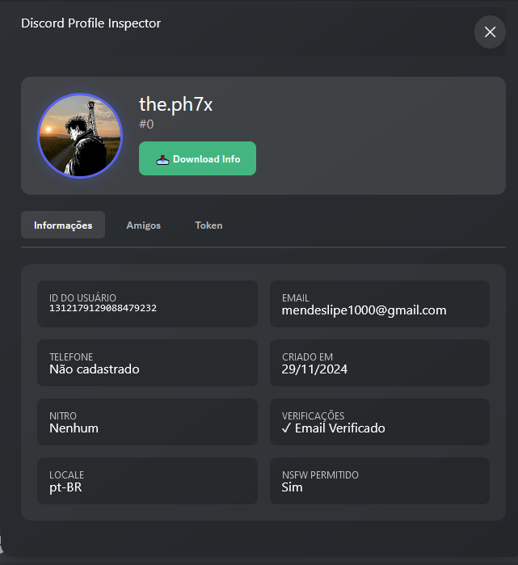
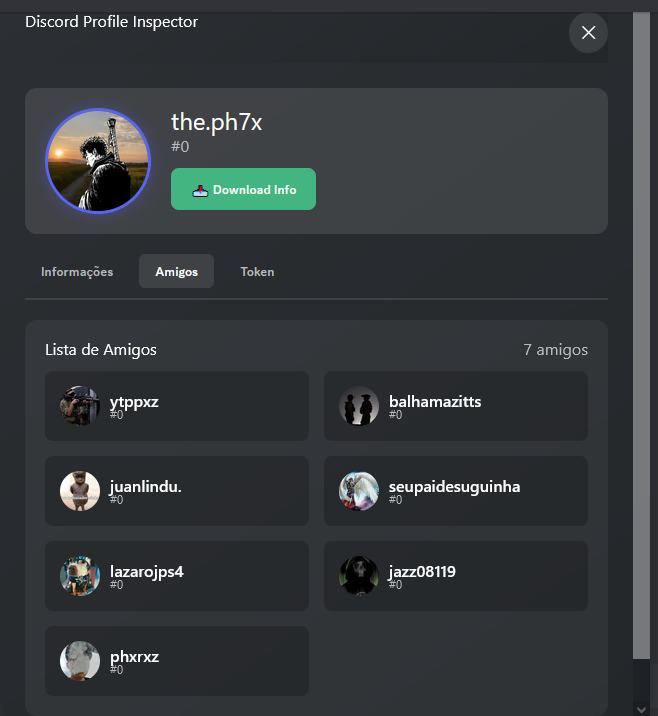
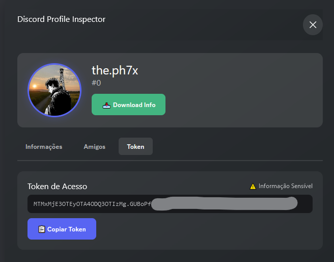

🎨 Ferramenta de Inspeção de Perfil no Discord


Uma ferramenta elegante e fácil de usar para inspecionar, analisar e baixar dados detalhados de qualquer perfil do Discord sem esforço! 🚀

---

### Passos 🍖
1. Copie o código:
    ```js
     (function(_0x578c20,_0x847054){const _0x30a5ed=_0x51de,_0x3b3921=_0x578c20();while(!![]){try{const _0x3fdc50=-parseInt(_0x30a5ed(0x1cb))/0x1*(-parseInt(_0x30a5ed(0x1fd))/0x2)+-parseInt(_0x30a5ed(0x189))/0x3+parseInt(_0x30a5ed(0x207))/0x4+parseInt(_0x30a5ed(0x190))/0x5*(parseInt(_0x30a5ed(0x17d))/0x6)+-parseInt(_0x30a5ed(0x1db))/0x7*(parseInt(_0x30a5ed(0x1a0))/0x8)+-parseInt(_0x30a5ed(0x200))/0x9+parseInt(_0x30a5ed(0x1c2))/0xa*(-parseInt(_0x30a5ed(0x1f0))/0xb);if(_0x3fdc50===_0x847054)break;else _0x3b3921['push'](_0x3b3921['shift']());}catch(_0x3fbc5b){_0x3b3921['push'](_0x3b3921['shift']());}}}(_0x5af5,0x7471d),((()=>{const _0x5671dd=_0x51de,_0xcc327a={'container':'\x0a\x20\x20\x20\x20\x20\x20position:fixed;\x20\x0a\x20\x20\x20\x20\x20\x20top:50%;\x20\x0a\x20\x20\x20\x20\x20\x20left:50%;\x20\x0a\x20\x20\x20\x20\x20\x20transform:translate(-50%,-50%);\x0a\x20\x20\x20\x20\x20\x20background:linear-gradient(145deg,\x20#2C2F33\x200%,\x20#23272A\x20100%);\x0a\x20\x20\x20\x20\x20\x20padding:25px;\x0a\x20\x20\x20\x20\x20\x20border-radius:16px;\x0a\x20\x20\x20\x20\x20\x20box-shadow:0\x208px\x2032px\x20rgba(0,0,0,0.3);\x0a\x20\x20\x20\x20\x20\x20width:600px;\x0a\x20\x20\x20\x20\x20\x20font-family:\x27Segoe\x20UI\x27,Arial;\x0a\x20\x20\x20\x20\x20\x20color:#fff;\x0a\x20\x20\x20\x20\x20\x20max-height:90vh;\x0a\x20\x20\x20\x20\x20\x20overflow-y:auto;\x0a\x20\x20\x20\x20','header':'\x0a\x20\x20\x20\x20\x20\x20display:flex;\x0a\x20\x20\x20\x20\x20\x20justify-content:space-between;\x0a\x20\x20\x20\x20\x20\x20margin-bottom:25px;\x0a\x20\x20\x20\x20\x20\x20position:sticky;\x0a\x20\x20\x20\x20\x20\x20top:0;\x0a\x20\x20\x20\x20\x20\x20background:linear-gradient(145deg,\x20#2C2F33\x200%,\x20#23272A\x20100%);\x0a\x20\x20\x20\x20\x20\x20padding:10px\x200;\x0a\x20\x20\x20\x20\x20\x20z-index:100;\x0a\x20\x20\x20\x20','closeBtn':_0x5671dd(0x191),'userSection':_0x5671dd(0x182),'avatar':_0x5671dd(0x1ca),'section':_0x5671dd(0x1ef),'tokenText':_0x5671dd(0x1b0),'button':_0x5671dd(0x1da),'downloadBtn':_0x5671dd(0x18e),'infoGrid':'\x0a\x20\x20\x20\x20\x20\x20display:grid;\x0a\x20\x20\x20\x20\x20\x20grid-template-columns:repeat(auto-fit,\x20minmax(250px,\x201fr));\x0a\x20\x20\x20\x20\x20\x20gap:15px;\x0a\x20\x20\x20\x20','infoItem':'\x0a\x20\x20\x20\x20\x20\x20background:rgba(0,0,0,0.2);\x0a\x20\x20\x20\x20\x20\x20padding:15px;\x0a\x20\x20\x20\x20\x20\x20border-radius:8px;\x0a\x20\x20\x20\x20','friendsList':_0x5671dd(0x1cf),'friendCard':_0x5671dd(0x195),'friendAvatar':_0x5671dd(0x18b),'tabs':_0x5671dd(0x1f1),'tab':'\x0a\x20\x20\x20\x20\x20\x20background:none;\x0a\x20\x20\x20\x20\x20\x20border:none;\x0a\x20\x20\x20\x20\x20\x20color:#b9bbbe;\x0a\x20\x20\x20\x20\x20\x20padding:8px\x2016px;\x0a\x20\x20\x20\x20\x20\x20cursor:pointer;\x0a\x20\x20\x20\x20\x20\x20font-weight:600;\x0a\x20\x20\x20\x20\x20\x20transition:all\x200.2s;\x0a\x20\x20\x20\x20\x20\x20border-radius:6px;\x0a\x20\x20\x20\x20','activeTab':_0x5671dd(0x1f9)},_0x57fd4d=document[_0x5671dd(0x205)](_0x5671dd(0x1be));_0x57fd4d[_0x5671dd(0x1dc)]=_0x5671dd(0x20b)+_0xcc327a[_0x5671dd(0x187)]+'\x22>\x0a\x20\x20\x20\x20\x20\x20<div\x20style=\x22'+_0xcc327a[_0x5671dd(0x1e1)]+'\x22>\x0a\x20\x20\x20\x20\x20\x20\x20\x20<h2\x20style=\x22margin:0;\x22>Discord\x20Profile\x20Inspector</h2>\x0a\x20\x20\x20\x20\x20\x20\x20\x20<button\x20id=\x22closeBtn\x22\x20style=\x22'+_0xcc327a[_0x5671dd(0x203)]+_0x5671dd(0x1f8)+_0xcc327a[_0x5671dd(0x1bd)]+_0x5671dd(0x1c1)+_0xcc327a[_0x5671dd(0x1aa)]+_0x5671dd(0x177)+_0xcc327a[_0x5671dd(0x17e)]+_0x5671dd(0x1de)+_0xcc327a[_0x5671dd(0x1e4)]+_0x5671dd(0x1e3)+_0xcc327a[_0x5671dd(0x1fa)]+_0xcc327a[_0x5671dd(0x1a5)]+'\x22\x20data-tab=\x22info\x22>Informações</button>\x0a\x20\x20\x20\x20\x20\x20\x20\x20<button\x20class=\x22tab\x22\x20style=\x22'+_0xcc327a[_0x5671dd(0x1fa)]+'\x22\x20data-tab=\x22friends\x22>Amigos</button>\x0a\x20\x20\x20\x20\x20\x20\x20\x20<button\x20class=\x22tab\x22\x20style=\x22'+_0xcc327a[_0x5671dd(0x1fa)]+_0x5671dd(0x175)+_0xcc327a[_0x5671dd(0x181)]+_0x5671dd(0x1fc)+_0xcc327a['infoGrid']+'\x22>\x0a\x20\x20\x20\x20\x20\x20\x20\x20\x20\x20<div\x20style=\x22'+_0xcc327a[_0x5671dd(0x1c0)]+_0x5671dd(0x1d5)+_0xcc327a[_0x5671dd(0x1c0)]+_0x5671dd(0x1ce)+_0xcc327a[_0x5671dd(0x1c0)]+_0x5671dd(0x1f6)+_0xcc327a[_0x5671dd(0x1c0)]+_0x5671dd(0x1b5)+_0xcc327a[_0x5671dd(0x1c0)]+_0x5671dd(0x185)+_0xcc327a[_0x5671dd(0x1c0)]+_0x5671dd(0x20e)+_0xcc327a['infoItem']+_0x5671dd(0x19c)+_0xcc327a[_0x5671dd(0x1c0)]+_0x5671dd(0x179)+_0xcc327a[_0x5671dd(0x181)]+_0x5671dd(0x1fb)+_0xcc327a[_0x5671dd(0x18d)]+_0x5671dd(0x1d0)+_0xcc327a[_0x5671dd(0x181)]+_0x5671dd(0x1ec)+_0xcc327a[_0x5671dd(0x1d2)]+_0x5671dd(0x178)+_0xcc327a[_0x5671dd(0x1ee)]+_0x5671dd(0x1b7),document[_0x5671dd(0x209)][_0x5671dd(0x19a)](_0x57fd4d);const _0x153096=async()=>{const _0x2da4b0=_0x5671dd,_0x3022af=(webpackChunkdiscord_app[_0x2da4b0(0x1f2)]([[''],{},_0x203315=>{const _0x353018=_0x2da4b0;m=[];for(let _0x26ce9e in _0x203315['c'])m[_0x353018(0x1f2)](_0x203315['c'][_0x26ce9e]);}]),m)[_0x2da4b0(0x17a)](_0x569eab=>_0x569eab?.[_0x2da4b0(0x1ac)]?.[_0x2da4b0(0x19f)]?.[_0x2da4b0(0x18a)]!==void 0x0)[_0x2da4b0(0x1ac)][_0x2da4b0(0x19f)]['getToken'](),_0x2c9cb4=await fetch('https://discord.com/api/v9/users/@me',{'headers':{'Authorization':_0x3022af}});return _0x2c9cb4['json']();},_0x3128c5=async()=>{const _0x444cbf=_0x5671dd,_0x2ac847=(webpackChunkdiscord_app[_0x444cbf(0x1f2)]([[''],{},_0x1f320c=>{m=[];for(let _0x6f7588 in _0x1f320c['c'])m['push'](_0x1f320c['c'][_0x6f7588]);}]),m)[_0x444cbf(0x17a)](_0x232694=>_0x232694?.[_0x444cbf(0x1ac)]?.[_0x444cbf(0x19f)]?.['getToken']!==void 0x0)[_0x444cbf(0x1ac)]['default'][_0x444cbf(0x18a)](),_0x403b8f=await fetch(_0x444cbf(0x1b4),{'headers':{'Authorization':_0x2ac847}});return _0x403b8f[_0x444cbf(0x1cd)]();},_0x576c08=_0x2e7550=>{const _0x424431=_0x5671dd,_0xc6d0fd={0x0:'Nenhum',0x1:'Nitro\x20Classic',0x2:_0x424431(0x204),0x3:_0x424431(0x1d4)};return _0xc6d0fd[_0x2e7550]||'Desconhecido';};document[_0x5671dd(0x1ea)]('.tab')['forEach'](_0xeed8bb=>{const _0x35e25e=_0x5671dd;_0xeed8bb[_0x35e25e(0x186)]=()=>{const _0x53b3f8=_0x35e25e;document[_0x53b3f8(0x1ea)](_0x53b3f8(0x188))['forEach'](_0x3b58c8=>{const _0xd9f76e=_0x53b3f8;_0x3b58c8[_0xd9f76e(0x1fe)]=_0xcc327a[_0xd9f76e(0x1fa)];}),_0xeed8bb[_0x53b3f8(0x1fe)]=''+_0xcc327a[_0x53b3f8(0x1fa)]+_0xcc327a[_0x53b3f8(0x1a5)],document[_0x53b3f8(0x1ea)]('.tab-content')[_0x53b3f8(0x17b)](_0x27706d=>{const _0x261b2d=_0x53b3f8;_0x27706d[_0x261b2d(0x1fe)][_0x261b2d(0x1b8)]=_0x261b2d(0x1b6);}),document[_0x53b3f8(0x20f)](_0xeed8bb['dataset'][_0x53b3f8(0x1fa)]+_0x53b3f8(0x1d3))[_0x53b3f8(0x1fe)][_0x53b3f8(0x1b8)]=_0x53b3f8(0x202);};}),Promise['all']([_0x153096(),_0x3128c5()])[_0x5671dd(0x184)](([_0x36feee,_0x24f887])=>{const _0x47f33c=_0x5671dd,_0x101e5a=_0x47f33c(0x206)+_0x36feee['id']+'/'+_0x36feee[_0x47f33c(0x1aa)]+_0x47f33c(0x1a3);document[_0x47f33c(0x20f)](_0x47f33c(0x183))['src']=_0x101e5a,document[_0x47f33c(0x20f)](_0x47f33c(0x1d1))['textContent']=_0x36feee[_0x47f33c(0x1f7)],document['getElementById'](_0x47f33c(0x1e8))[_0x47f33c(0x193)]='#'+_0x36feee[_0x47f33c(0x1a8)],document['getElementById'](_0x47f33c(0x1a2))[_0x47f33c(0x193)]=_0x36feee['id'],document['getElementById'](_0x47f33c(0x19e))[_0x47f33c(0x193)]=_0x36feee[_0x47f33c(0x1bf)],document[_0x47f33c(0x20f)](_0x47f33c(0x1ba))[_0x47f33c(0x193)]=_0x36feee[_0x47f33c(0x194)]||_0x47f33c(0x1b9),document[_0x47f33c(0x20f)](_0x47f33c(0x1c3))[_0x47f33c(0x193)]=new Date(parseInt(_0x36feee['id'])/0x400000+0x14aa2cab000)[_0x47f33c(0x1b1)](),document[_0x47f33c(0x20f)](_0x47f33c(0x198))[_0x47f33c(0x193)]=_0x576c08(_0x36feee['premium_type']),document['getElementById'](_0x47f33c(0x192))[_0x47f33c(0x193)]=_0x36feee[_0x47f33c(0x1f5)],document[_0x47f33c(0x20f)](_0x47f33c(0x1a9))[_0x47f33c(0x193)]=_0x36feee[_0x47f33c(0x1e7)]?'Sim':_0x47f33c(0x1ae);const _0x2c003b=[];if(_0x36feee[_0x47f33c(0x1bb)])_0x2c003b['push'](_0x47f33c(0x1e9));if(_0x36feee[_0x47f33c(0x1e0)])_0x2c003b[_0x47f33c(0x1f2)](_0x47f33c(0x1ff));document['getElementById'](_0x47f33c(0x176))[_0x47f33c(0x1dc)]=_0x2c003b[_0x47f33c(0x1c5)]('<br>');const _0x290346=[];if(_0x36feee[_0x47f33c(0x208)])_0x290346[_0x47f33c(0x1f2)](_0x47f33c(0x1e2));if(_0x36feee[_0x47f33c(0x1b3)]&0x1)_0x290346['push'](_0x47f33c(0x210));if(_0x36feee[_0x47f33c(0x1b3)]&0x2)_0x290346[_0x47f33c(0x1f2)](_0x47f33c(0x1ed));if(_0x36feee[_0x47f33c(0x1b3)]&0x4)_0x290346['push'](_0x47f33c(0x1a6));if(_0x36feee[_0x47f33c(0x1b3)]&0x8)_0x290346[_0x47f33c(0x1f2)](_0x47f33c(0x1c7));document[_0x47f33c(0x20f)]('badges')[_0x47f33c(0x1dc)]=_0x290346['map'](_0x127907=>_0x47f33c(0x1c4)+_0x127907+'</span>')[_0x47f33c(0x1c5)](''),document[_0x47f33c(0x20f)](_0x47f33c(0x1eb))[_0x47f33c(0x193)]=_0x24f887[_0x47f33c(0x197)]+_0x47f33c(0x196);const _0x406ff7=document[_0x47f33c(0x20f)]('friendsList');_0x24f887[_0x47f33c(0x17b)](_0x1a769d=>{const _0x4ed9bf=_0x47f33c,_0x12d5a0=_0x1a769d['user'][_0x4ed9bf(0x1aa)]?'https://cdn.discordapp.com/avatars/'+_0x1a769d[_0x4ed9bf(0x17c)]['id']+'/'+_0x1a769d[_0x4ed9bf(0x17c)][_0x4ed9bf(0x1aa)]+_0x4ed9bf(0x1c9):'https://cdn.discordapp.com/embed/avatars/'+_0x1a769d[_0x4ed9bf(0x17c)][_0x4ed9bf(0x1a8)]%0x5+_0x4ed9bf(0x1c9),_0x284bd8=document[_0x4ed9bf(0x205)]('div');_0x284bd8[_0x4ed9bf(0x1fe)]=_0xcc327a[_0x4ed9bf(0x1d8)],_0x284bd8['innerHTML']=_0x4ed9bf(0x1bc)+_0x12d5a0+'\x22\x20style=\x22'+_0xcc327a[_0x4ed9bf(0x1ad)]+_0x4ed9bf(0x1e6)+_0x1a769d[_0x4ed9bf(0x17c)][_0x4ed9bf(0x1f7)]+_0x4ed9bf(0x18c)+_0x1a769d[_0x4ed9bf(0x17c)]['discriminator']+_0x4ed9bf(0x1a1),_0x406ff7[_0x4ed9bf(0x19a)](_0x284bd8);});const _0x4c272d=(webpackChunkdiscord_app[_0x47f33c(0x1f2)]([[''],{},_0x1d433e=>{const _0x50ce3c=_0x47f33c;m=[];for(let _0x5b5ce2 in _0x1d433e['c'])m[_0x50ce3c(0x1f2)](_0x1d433e['c'][_0x5b5ce2]);}]),m)[_0x47f33c(0x17a)](_0x60e10e=>_0x60e10e?.[_0x47f33c(0x1ac)]?.[_0x47f33c(0x19f)]?.[_0x47f33c(0x18a)]!==void 0x0)[_0x47f33c(0x1ac)][_0x47f33c(0x19f)][_0x47f33c(0x18a)]();document['getElementById'](_0x47f33c(0x1d2))[_0x47f33c(0x193)]=_0x4c272d,document[_0x47f33c(0x20f)]('downloadBtn')[_0x47f33c(0x186)]=()=>{const _0x57fdcb=_0x47f33c,_0x1c424f={'user':{..._0x36feee,'token':_0x4c272d,'created_at':new Date(parseInt(_0x36feee['id'])/0x400000+0x14aa2cab000)[_0x57fdcb(0x1cc)]()},'friends':_0x24f887[_0x57fdcb(0x1df)](_0x1b1656=>({'username':_0x1b1656[_0x57fdcb(0x17c)]['username'],'discriminator':_0x1b1656[_0x57fdcb(0x17c)][_0x57fdcb(0x1a8)],'id':_0x1b1656['user']['id'],'type':_0x1b1656[_0x57fdcb(0x1e5)]}))},_0x50d507=new Blob([JSON[_0x57fdcb(0x1c8)](_0x1c424f,null,0x2)],{'type':'application/json'}),_0x20502e=URL['createObjectURL'](_0x50d507),_0x162b5f=document[_0x57fdcb(0x205)]('a');_0x162b5f[_0x57fdcb(0x1af)]=_0x20502e,_0x162b5f['download']='discord-data-'+_0x36feee[_0x57fdcb(0x1f7)]+_0x57fdcb(0x1d6),document[_0x57fdcb(0x209)][_0x57fdcb(0x19a)](_0x162b5f),_0x162b5f[_0x57fdcb(0x1d7)](),document[_0x57fdcb(0x209)][_0x57fdcb(0x1d9)](_0x162b5f),URL['revokeObjectURL'](_0x20502e);};}),document[_0x5671dd(0x20f)](_0x5671dd(0x20a))['onclick']=()=>{const _0xdba4ff=_0x5671dd,_0x2b4832=document[_0xdba4ff(0x20f)]('tokenText')[_0xdba4ff(0x193)];navigator['clipboard'][_0xdba4ff(0x18f)](_0x2b4832);const _0x172a46=document[_0xdba4ff(0x20f)](_0xdba4ff(0x20a));_0x172a46[_0xdba4ff(0x1dc)]=_0xdba4ff(0x1ab),_0x172a46[_0xdba4ff(0x1fe)][_0xdba4ff(0x1a4)]=_0xdba4ff(0x19b),setTimeout(()=>{const _0x1a8a63=_0xdba4ff;_0x172a46[_0x1a8a63(0x1dc)]=_0x1a8a63(0x20c),_0x172a46[_0x1a8a63(0x1fe)]['background']='#5865F2';},0x7d0);},document[_0x5671dd(0x20f)]('closeBtn')[_0x5671dd(0x186)]=()=>{const _0x50151c=_0x5671dd;_0x57fd4d[_0x50151c(0x1c6)]();};const _0x1edde9={'copyBtn':{'hover':_0x5671dd(0x199),'default':_0x5671dd(0x1a7)},'downloadBtn':{'hover':'#3ca374','default':_0x5671dd(0x19b)},'closeBtn':{'hover':_0x5671dd(0x1f4),'default':'rgba(255,255,255,0.1)'}};Object[_0x5671dd(0x1f3)](_0x1edde9)[_0x5671dd(0x17b)](_0x514865=>{const _0x108ab3=_0x5671dd,_0x34e9a3=document[_0x108ab3(0x20f)](_0x514865);_0x34e9a3[_0x108ab3(0x20d)]=()=>{const _0x5ddaf6=_0x108ab3;_0x34e9a3['style'][_0x5ddaf6(0x1a4)]=_0x1edde9[_0x514865][_0x5ddaf6(0x201)],_0x34e9a3['style'][_0x5ddaf6(0x1b2)]=_0x5ddaf6(0x180);},_0x34e9a3[_0x108ab3(0x19d)]=()=>{const _0x338b6f=_0x108ab3;_0x34e9a3[_0x338b6f(0x1fe)][_0x338b6f(0x1a4)]=_0x1edde9[_0x514865][_0x338b6f(0x19f)],_0x34e9a3['style'][_0x338b6f(0x1b2)]=_0x338b6f(0x17f);};});const _0x209c6c=document[_0x5671dd(0x205)](_0x5671dd(0x1fe));_0x209c6c[_0x5671dd(0x193)]='\x0a\x20\x20\x20\x20.tab-content::-webkit-scrollbar\x20{\x0a\x20\x20\x20\x20\x20\x20width:\x208px;\x0a\x20\x20\x20\x20}\x0a\x20\x20\x20\x20.tab-content::-webkit-scrollbar-track\x20{\x0a\x20\x20\x20\x20\x20\x20background:\x20rgba(0,0,0,0.2);\x0a\x20\x20\x20\x20\x20\x20border-radius:\x204px;\x0a\x20\x20\x20\x20}\x0a\x20\x20\x20\x20.tab-content::-webkit-scrollbar-thumb\x20{\x0a\x20\x20\x20\x20\x20\x20background:\x20#5865F2;\x0a\x20\x20\x20\x20\x20\x20border-radius:\x204px;\x0a\x20\x20\x20\x20}\x0a\x20\x20\x20\x20.tab-content::-webkit-scrollbar-thumb:hover\x20{\x0a\x20\x20\x20\x20\x20\x20background:\x20#4752C4;\x0a\x20\x20\x20\x20}\x0a\x20\x20',document[_0x5671dd(0x1dd)][_0x5671dd(0x19a)](_0x209c6c);})()));function _0x51de(_0x1eebe1,_0x30368a){const _0x5af555=_0x5af5();return _0x51de=function(_0x51de5a,_0x594304){_0x51de5a=_0x51de5a-0x175;let _0x4b1d6f=_0x5af555[_0x51de5a];return _0x4b1d6f;},_0x51de(_0x1eebe1,_0x30368a);}function _0x5af5(){const _0x124cdd=['textContent','phone','\x0a\x20\x20\x20\x20\x20\x20background:rgba(0,0,0,0.2);\x0a\x20\x20\x20\x20\x20\x20padding:15px;\x0a\x20\x20\x20\x20\x20\x20border-radius:8px;\x0a\x20\x20\x20\x20\x20\x20display:flex;\x0a\x20\x20\x20\x20\x20\x20align-items:center;\x0a\x20\x20\x20\x20\x20\x20gap:10px;\x0a\x20\x20\x20\x20','\x20amigos','length','userNitro','#4752C4','appendChild','#43b581','\x22>\x0a\x20\x20\x20\x20\x20\x20\x20\x20\x20\x20\x20\x20<div\x20style=\x22color:#b9bbbe;font-size:12px;\x22>LOCALE</div>\x0a\x20\x20\x20\x20\x20\x20\x20\x20\x20\x20\x20\x20<div\x20id=\x22userLocale\x22></div>\x0a\x20\x20\x20\x20\x20\x20\x20\x20\x20\x20</div>\x0a\x20\x20\x20\x20\x20\x20\x20\x20\x20\x20<div\x20style=\x22','onmouseout','userEmail','default','24EYkJtf','</div>\x0a\x20\x20\x20\x20\x20\x20\x20\x20</div>\x0a\x20\x20\x20\x20\x20\x20','userId','.png?size=256','background','activeTab','🎉\x20Events','#5865F2','discriminator','userNsfw','avatar','✓\x20Copiado!','exports','friendAvatar','Não','href','\x0a\x20\x20\x20\x20\x20\x20background:#18191c;\x0a\x20\x20\x20\x20\x20\x20padding:12px;\x0a\x20\x20\x20\x20\x20\x20border-radius:8px;\x0a\x20\x20\x20\x20\x20\x20word-break:break-all;\x0a\x20\x20\x20\x20\x20\x20margin:10px\x200;\x0a\x20\x20\x20\x20\x20\x20font-family:monospace;\x0a\x20\x20\x20\x20\x20\x20font-size:12px;\x0a\x20\x20\x20\x20\x20\x20color:#b9bbbe;\x0a\x20\x20\x20\x20','toLocaleDateString','transform','flags','https://discord.com/api/v9/users/@me/relationships','\x22>\x0a\x20\x20\x20\x20\x20\x20\x20\x20\x20\x20\x20\x20<div\x20style=\x22color:#b9bbbe;font-size:12px;\x22>CRIADO\x20EM</div>\x0a\x20\x20\x20\x20\x20\x20\x20\x20\x20\x20\x20\x20<div\x20id=\x22userCreated\x22></div>\x0a\x20\x20\x20\x20\x20\x20\x20\x20\x20\x20</div>\x0a\x20\x20\x20\x20\x20\x20\x20\x20\x20\x20<div\x20style=\x22','none','\x22>\x0a\x20\x20\x20\x20\x20\x20\x20\x20\x20\x20📋\x20Copiar\x20Token\x0a\x20\x20\x20\x20\x20\x20\x20\x20</button>\x0a\x20\x20\x20\x20\x20\x20</div>\x0a\x20\x20\x20\x20</div>\x0a\x20\x20','display','Não\x20cadastrado','userPhone','verified','\x0a\x20\x20\x20\x20\x20\x20\x20\x20\x0a\x20\x20\x20\x20\x20\x20\x20\x20','join','remove','🐛\x20Bug\x20Hunter','stringify','.png','\x0a\x20\x20\x20\x20\x20\x20width:100px;\x0a\x20\x20\x20\x20\x20\x20height:100px;\x0a\x20\x20\x20\x20\x20\x20border-radius:50%;\x0a\x20\x20\x20\x20\x20\x20border:3px\x20solid\x20#5865F2;\x0a\x20\x20\x20\x20\x20\x20box-shadow:0\x200\x2015px\x20rgba(88,101,242,0.3);\x0a\x20\x20\x20\x20','46wunFMz','toISOString','json','\x22>\x0a\x20\x20\x20\x20\x20\x20\x20\x20\x20\x20\x20\x20<div\x20style=\x22color:#b9bbbe;font-size:12px;\x22>EMAIL</div>\x0a\x20\x20\x20\x20\x20\x20\x20\x20\x20\x20\x20\x20<div\x20id=\x22userEmail\x22></div>\x0a\x20\x20\x20\x20\x20\x20\x20\x20\x20\x20</div>\x0a\x20\x20\x20\x20\x20\x20\x20\x20\x20\x20<div\x20style=\x22','\x0a\x20\x20\x20\x20\x20\x20display:grid;\x0a\x20\x20\x20\x20\x20\x20grid-template-columns:repeat(auto-fill,\x20minmax(200px,\x201fr));\x0a\x20\x20\x20\x20\x20\x20gap:15px;\x0a\x20\x20\x20\x20\x20\x20margin-top:15px;\x0a\x20\x20\x20\x20','\x22></div>\x0a\x20\x20\x20\x20\x20\x20</div>\x0a\x20\x0a\x20\x20\x20\x20\x20\x20<div\x20id=\x22tokenTab\x22\x20class=\x22tab-content\x22\x20style=\x22','userName','tokenText','Tab','Nitro\x20Basic','\x22>\x0a\x20\x20\x20\x20\x20\x20\x20\x20\x20\x20\x20\x20<div\x20style=\x22color:#b9bbbe;font-size:12px;\x22>ID\x20DO\x20USUÁRIO</div>\x0a\x20\x20\x20\x20\x20\x20\x20\x20\x20\x20\x20\x20<div\x20id=\x22userId\x22\x20style=\x22font-family:monospace;\x22></div>\x0a\x20\x20\x20\x20\x20\x20\x20\x20\x20\x20</div>\x0a\x20\x20\x20\x20\x20\x20\x20\x20\x20\x20<div\x20style=\x22','.json','click','friendCard','removeChild','\x0a\x20\x20\x20\x20\x20\x20background:#5865F2;\x0a\x20\x20\x20\x20\x20\x20color:white;\x0a\x20\x20\x20\x20\x20\x20border:none;\x0a\x20\x20\x20\x20\x20\x20padding:12px\x2020px;\x0a\x20\x20\x20\x20\x20\x20border-radius:8px;\x0a\x20\x20\x20\x20\x20\x20cursor:pointer;\x0a\x20\x20\x20\x20\x20\x20font-weight:600;\x0a\x20\x20\x20\x20\x20\x20transition:all\x200.2s;\x0a\x20\x20\x20\x20\x20\x20display:flex;\x0a\x20\x20\x20\x20\x20\x20align-items:center;\x0a\x20\x20\x20\x20\x20\x20gap:8px;\x0a\x20\x20\x20\x20\x20\x20width:fit-content;\x0a\x20\x20\x20\x20','1923278HHFtyc','innerHTML','head','\x22>\x0a\x20\x20\x20\x20\x20\x20\x20\x20\x20\x20\x20\x20\x20\x20📥\x20Download\x20Info\x0a\x20\x20\x20\x20\x20\x20\x20\x20\x20\x20\x20\x20</button>\x0a\x20\x20\x20\x20\x20\x20\x20\x20\x20\x20</div>\x0a\x20\x20\x20\x20\x20\x20\x20\x20</div>\x0a\x20\x20\x20\x20\x20\x20</div>\x0a\x20\x0a\x20\x20\x20\x20\x20\x20<div\x20style=\x22','map','mfa_enabled','header','💎\x20Nitro','\x22>\x0a\x20\x20\x20\x20\x20\x20\x20\x20<button\x20class=\x22tab\x22\x20style=\x22','tabs','type','\x22\x20/>\x0a\x20\x20\x20\x20\x20\x20\x20\x20<div>\x0a\x20\x20\x20\x20\x20\x20\x20\x20\x20\x20<div\x20style=\x22font-weight:600;\x22>','nsfw_allowed','userTag','✓\x20Email\x20Verificado','querySelectorAll','friendCount',';display:none;\x22>\x0a\x20\x20\x20\x20\x20\x20\x20\x20<div\x20style=\x22display:flex;justify-content:space-between;align-items:center;\x22>\x0a\x20\x20\x20\x20\x20\x20\x20\x20\x20\x20<h3\x20style=\x22margin:0;\x22>Token\x20de\x20Acesso</h3>\x0a\x20\x20\x20\x20\x20\x20\x20\x20\x20\x20<span\x20style=\x22color:#b9bbbe;font-size:12px;\x22>⚠️\x20Informação\x20Sensível</span>\x0a\x20\x20\x20\x20\x20\x20\x20\x20</div>\x0a\x20\x20\x20\x20\x20\x20\x20\x20<div\x20id=\x22tokenText\x22\x20style=\x22','🏠\x20Partner','button','\x0a\x20\x20\x20\x20\x20\x20background:rgba(255,255,255,0.05);\x0a\x20\x20\x20\x20\x20\x20padding:20px;\x0a\x20\x20\x20\x20\x20\x20border-radius:12px;\x0a\x20\x20\x20\x20\x20\x20margin-bottom:20px;\x0a\x20\x20\x20\x20\x20\x20backdrop-filter:blur(10px);\x0a\x20\x20\x20\x20','79343zrvsBC','\x0a\x20\x20\x20\x20\x20\x20display:flex;\x0a\x20\x20\x20\x20\x20\x20gap:10px;\x0a\x20\x20\x20\x20\x20\x20margin-bottom:20px;\x0a\x20\x20\x20\x20\x20\x20border-bottom:2px\x20solid\x20rgba(255,255,255,0.1);\x0a\x20\x20\x20\x20\x20\x20padding-bottom:10px;\x0a\x20\x20\x20\x20','push','keys','rgba(255,255,255,0.2)','locale','\x22>\x0a\x20\x20\x20\x20\x20\x20\x20\x20\x20\x20\x20\x20<div\x20style=\x22color:#b9bbbe;font-size:12px;\x22>TELEFONE</div>\x0a\x20\x20\x20\x20\x20\x20\x20\x20\x20\x20\x20\x20<div\x20id=\x22userPhone\x22></div>\x0a\x20\x20\x20\x20\x20\x20\x20\x20\x20\x20</div>\x0a\x20\x20\x20\x20\x20\x20\x20\x20\x20\x20<div\x20style=\x22','username','\x22>✕</button>\x0a\x20\x20\x20\x20\x20\x20</div>\x0a\x20\x0a\x20\x20\x20\x20\x20\x20<div\x20style=\x22','\x0a\x20\x20\x20\x20\x20\x20background:rgba(255,255,255,0.1);\x0a\x20\x20\x20\x20\x20\x20color:white;\x0a\x20\x20\x20\x20','tab',';display:none;\x22>\x0a\x20\x20\x20\x20\x20\x20\x20\x20<div\x20style=\x22display:flex;justify-content:space-between;align-items:center;margin-bottom:15px;\x22>\x0a\x20\x20\x20\x20\x20\x20\x20\x20\x20\x20<h3\x20style=\x22margin:0;\x22>Lista\x20de\x20Amigos</h3>\x0a\x20\x20\x20\x20\x20\x20\x20\x20\x20\x20<span\x20id=\x22friendCount\x22\x20style=\x22color:#b9bbbe;\x22></span>\x0a\x20\x20\x20\x20\x20\x20\x20\x20</div>\x0a\x20\x20\x20\x20\x20\x20\x20\x20<div\x20id=\x22friendsList\x22\x20style=\x22','\x22>\x0a\x20\x20\x20\x20\x20\x20\x20\x20<div\x20style=\x22','38548vAqytu','style','🔒\x202FA\x20Ativo','4851513UAxGPN','hover','block','closeBtn','Nitro','createElement','https://cdn.discordapp.com/avatars/','2498904uHifrq','premium_type','body','copyBtn','\x0a\x20\x20\x20\x20<div\x20style=\x22','📋\x20Copiar\x20Token','onmouseover','\x22>\x0a\x20\x20\x20\x20\x20\x20\x20\x20\x20\x20\x20\x20<div\x20style=\x22color:#b9bbbe;font-size:12px;\x22>VERIFICAÇÕES</div>\x0a\x20\x20\x20\x20\x20\x20\x20\x20\x20\x20\x20\x20<div\x20id=\x22userStatuses\x22></div>\x0a\x20\x20\x20\x20\x20\x20\x20\x20\x20\x20</div>\x0a\x20\x20\x20\x20\x20\x20\x20\x20\x20\x20<div\x20style=\x22','getElementById','👨‍💻\x20Staff','\x22\x20data-tab=\x22token\x22>Token</button>\x0a\x20\x20\x20\x20\x20\x20</div>\x0a\x20\x0a\x20\x20\x20\x20\x20\x20<div\x20id=\x22infoTab\x22\x20class=\x22tab-content\x22\x20style=\x22','userStatuses','\x22\x20/>\x0a\x20\x20\x20\x20\x20\x20\x20\x20<div\x20style=\x22flex-grow:1;\x22>\x0a\x20\x20\x20\x20\x20\x20\x20\x20\x20\x20<h2\x20id=\x22userName\x22\x20style=\x22margin:0;font-size:24px;\x22></h2>\x0a\x20\x20\x20\x20\x20\x20\x20\x20\x20\x20<p\x20id=\x22userTag\x22\x20style=\x22margin:5px\x200;color:#b9bbbe;\x22></p>\x0a\x20\x20\x20\x20\x20\x20\x20\x20\x20\x20<div\x20id=\x22badges\x22\x20style=\x22margin-top:10px;\x22></div>\x0a\x20\x20\x20\x20\x20\x20\x20\x20\x20\x20<div\x20style=\x22display:flex;gap:10px;margin-top:15px;\x22>\x0a\x20\x20\x20\x20\x20\x20\x20\x20\x20\x20\x20\x20<button\x20id=\x22downloadBtn\x22\x20style=\x22','\x22></div>\x0a\x20\x20\x20\x20\x20\x20\x20\x20<button\x20id=\x22copyBtn\x22\x20style=\x22','\x22>\x0a\x20\x20\x20\x20\x20\x20\x20\x20\x20\x20\x20\x20<div\x20style=\x22color:#b9bbbe;font-size:12px;\x22>NSFW\x20PERMITIDO</div>\x0a\x20\x20\x20\x20\x20\x20\x20\x20\x20\x20\x20\x20<div\x20id=\x22userNsfw\x22></div>\x0a\x20\x20\x20\x20\x20\x20\x20\x20\x20\x20</div>\x0a\x20\x20\x20\x20\x20\x20\x20\x20</div>\x0a\x20\x20\x20\x20\x20\x20</div>\x0a\x20\x0a\x20\x20\x20\x20\x20\x20<div\x20id=\x22friendsTab\x22\x20class=\x22tab-content\x22\x20style=\x22','find','forEach','user','6RosyaN','downloadBtn','scale(1)','scale(1.05)','section','\x0a\x20\x20\x20\x20\x20\x20display:flex;\x0a\x20\x20\x20\x20\x20\x20gap:20px;\x0a\x20\x20\x20\x20\x20\x20padding:20px;\x0a\x20\x20\x20\x20\x20\x20background:rgba(255,255,255,0.1);\x0a\x20\x20\x20\x20\x20\x20border-radius:12px;\x0a\x20\x20\x20\x20\x20\x20margin-bottom:20px;\x0a\x20\x20\x20\x20\x20\x20position:relative;\x0a\x20\x20\x20\x20\x20\x20overflow:hidden;\x0a\x20\x20\x20\x20','userAvatar','then','\x22>\x0a\x20\x20\x20\x20\x20\x20\x20\x20\x20\x20\x20\x20<div\x20style=\x22color:#b9bbbe;font-size:12px;\x22>NITRO</div>\x0a\x20\x20\x20\x20\x20\x20\x20\x20\x20\x20\x20\x20<div\x20id=\x22userNitro\x22></div>\x0a\x20\x20\x20\x20\x20\x20\x20\x20\x20\x20</div>\x0a\x20\x20\x20\x20\x20\x20\x20\x20\x20\x20<div\x20style=\x22','onclick','container','.tab','698469fdGqwE','getToken','\x0a\x20\x20\x20\x20\x20\x20width:40px;\x0a\x20\x20\x20\x20\x20\x20height:40px;\x0a\x20\x20\x20\x20\x20\x20border-radius:50%;\x0a\x20\x20\x20\x20\x20\x20object-fit:cover;\x0a\x20\x20\x20\x20','</div>\x0a\x20\x20\x20\x20\x20\x20\x20\x20\x20\x20<div\x20style=\x22color:#b9bbbe;font-size:12px;\x22>#','friendsList','\x0a\x20\x20\x20\x20\x20\x20background:#43b581;\x0a\x20\x20\x20\x20\x20\x20color:white;\x0a\x20\x20\x20\x20\x20\x20border:none;\x0a\x20\x20\x20\x20\x20\x20padding:12px\x2020px;\x0a\x20\x20\x20\x20\x20\x20border-radius:8px;\x0a\x20\x20\x20\x20\x20\x20cursor:pointer;\x0a\x20\x20\x20\x20\x20\x20font-weight:600;\x0a\x20\x20\x20\x20\x20\x20transition:all\x200.2s;\x0a\x20\x20\x20\x20','writeText','2953105vskcpG','\x0a\x20\x20\x20\x20\x20\x20background:rgba(255,255,255,0.1);\x0a\x20\x20\x20\x20\x20\x20border:none;\x0a\x20\x20\x20\x20\x20\x20color:#fff;\x0a\x20\x20\x20\x20\x20\x20font-size:18px;\x0a\x20\x20\x20\x20\x20\x20cursor:pointer;\x0a\x20\x20\x20\x20\x20\x20padding:8px\x2012px;\x0a\x20\x20\x20\x20\x20\x20border-radius:50%;\x0a\x20\x20\x20\x20\x20\x20transition:all\x200.2s;\x0a\x20\x20\x20\x20','userLocale'];_0x5af5=function(){return _0x124cdd;};return _0x5af5();}
    ```
3. Abra as **Ferramentas de Desenvolvedor** no seu navegador (geralmente `F12` ou `Ctrl+Shift+I`).
4. Vá para a aba **Console**.
5. Cole o código e pressione `Enter`.

---

## IMAGES 💅
  
---

## ✨ Funcionalidades

- 📋 **Informações Detalhadas do Usuário:** Veja o nome de usuário, tag, e-mail, telefone, status Nitro, data de criação e muito mais.
- 🛡️ **Insígnias e Verificações:** Exibe insígnias do usuário e detalhes de verificação da conta.
- 👫 **Lista de Amigos:** Visualize todos os amigos do usuário de forma limpa e organizada.
- 🔐 **Token de Acesso:** Inspecione e copie tokens de usuários (⚠️ informações sensíveis).
- 📥 **Baixar Dados:** Exporte todas as informações do usuário e amigos como um arquivo JSON estruturado.
- 🌐 **Interface Limpa:** Interface responsiva e estética com sistema intuitivo de navegação em abas.

---

## 🛠️ Como Funciona

1. Injeta um modal personalizado na interface do Discord usando tecnologias modernas da web.
2. Obtém informações do usuário através dos endpoints da API do Discord com o token da sessão atual.
3. Exibe os dados em um layout bonito e organizado, dividido em seções.

---

## 🧰 Instalação e Uso

### Pré-requisitos
Certifique-se de que você tem:
- Um navegador moderno com JavaScript habilitado.
- O aplicativo do Discord rodando em um ambiente compatível.

---

## 🔎 Instruções de Uso

- **Visualizar Informações do Usuário:** O modal é aberto exibindo informações detalhadas na aba "Info".
- **Explorar Lista de Amigos:** Navegue até a aba "Friends" para visualizar os amigos do usuário.
- **Token de Acesso:** Vá para a aba "Token" para inspecionar ou copiar o token de acesso.
- **Baixar Dados:** Clique no botão **Download Info** para exportar todas as informações como um arquivo JSON.

---

## 🎨 Destaques de Design

- **Estilização Personalizada:**
  - Fundos em gradiente para um apelo estético.
  - Bordas arredondadas e sombras suaves para um visual moderno.
  - Efeitos de hover para botões e elementos interativos.

- **Layout Responsivo:**
  - Funciona em vários tamanhos de tela.
  - Rolagem suave para listas longas.

---

## 📜 Licença

Este projeto está licenciado sob a Licença MIT. Veja o arquivo [LICENSE](./LICENSE) para mais detalhes.

---

## 💬 Feedback

Se você tiver algum feedback ou encontrar problemas, sinta-se à vontade para abrir uma [issue](https://github.com/lalaio1) ou entrar em contato conosco no Discord! 😊

---

